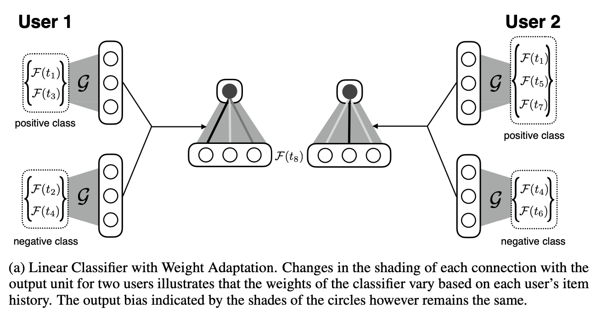

LWA
==============================================

Introduction
-------------------------

`[paper] <https://proceedings.neurips.cc/paper/2017/hash/51e6d6e679953c6311757004d8cbbba9-Abstract.html>`_

**Title:** A Meta-Learning Perspective on Cold-Start Recommendations for Items

**Authors:** Manasi Vartak, Arvind Thiagarajan, Conrado Miranda, Jeshua Bratman, Hugo Larochelle

**Abstract:**  Matrix factorization (MF) is one of the most popular techniques for product recommendation, but is known to suffer from serious cold-start problems. Item cold-start problems are particularly acute in settings such as Tweet recommendation where new items arrive continuously. In this paper, we present a meta-learning strategy to address item cold-start when new items arrive continuously. We propose two deep neural network architectures that implement our meta-learning strategy. The first architecture learns a linear classifier whose weights are determined by the item history while the second architecture learns a neural network whose biases are instead adjusted. We evaluate our techniques on the real-world problem of Tweet recommendation. On production data at Twitter, we demonstrate that our proposed techniques significantly beat the MF baseline and also outperform production models for Tweet recommendation.

Quick Start Example
-------------------------

**A Running Example:**

.. code:: python

    from recbole.utils import init_logger, init_seed
    from recbole.config import Config
    from MetaUtils import *

    modelName='LWA'
    datasetName='ml-100k'
    trainerName=modelName+'Trainer'
    configPath=['model/'+modelName+'/'+modelName+'.yaml']
    trainerClass = importlib.import_module('model.' + modelName + '.' + modelName + 'Trainer').__getattribute__(
            modelName + 'Trainer')
    modelClass = importlib.import_module('model.' + modelName + '.' + modelName).__getattribute__(modelName)

    if __name__ == '__main__':
        config = Config(model=modelClass, dataset=datasetName, config_file_list=configPath)
        init_seed(config['seed'], config['reproducibility'])

        # logger initialization
        init_logger(config)
        logger = getLogger()
        logger.info(config)

        # dataset filtering
        dataset = create_meta_dataset(config)
        logger.info(dataset)

        # dataset splitting
        train_data, valid_data, test_data = meta_data_preparation(config, dataset)
        logger.info(train_data)

        # model loading and initialization
        model = modelClass(config, train_data.dataset).to(config['device'])
        logger.info(model)

        # trainer loading and initialization
        trainer = trainerClass(config, model)

        # model training
        best_valid_score, best_valid_result = trainer.fit(train_data, valid_data)

        # model evaluation
        test_result = trainer.evaluate(test_data)

        logger.info('best valid result: {}'.format(best_valid_result))
        logger.info('test result: {}'.format(test_result))
