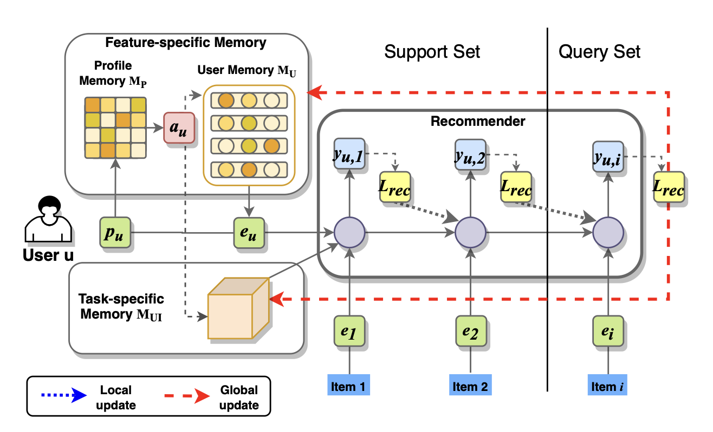

MAMO
==============================================

Introduction
-------------------------

`[paper] <https://doi.org/10.1145/3394486.3403113>`_

**Title:** MAMO: Memory-Augmented Meta-Optimization for Cold-start Recommendation

**Authors:** M Dong, F Yuan, L Yao, X Xu, L Zhu

**Abstract:**  A common challenge for most current recommender systems is the cold-start problem. Due to the lack of user-item interactions, the fine-tuned recommender systems are unable to handle situations with new users or new items. Recently, some works introduce the meta-optimization idea into the recommendation scenarios, i.e. predicting the user preference by only a few of past interacted items. The core idea is learning a global sharing initialization parameter for all users and then learning the local parameters for each user separately. However, most meta-learning based recommendation approaches adopt model-agnostic meta-learning for parameter initialization, where the global sharing parameter may lead the model into local optima for some users. In this paper, we design two memory matrices that can store task-specific memories and feature-specific memories. Specifically, the feature-specific memories are used to guide the model with personalized parameter initialization, while the task-specific memories are used to guide the model fast predicting the user preference. And we adopt a meta-optimization approach for optimizing the proposed method. We test the model on two widely used recommendation datasets and consider four cold-start situations. The experimental results show the effectiveness of the proposed methods.

Quick Start Example
-------------------------

**A Running Example:**

.. code:: python

    from recbole.utils import init_logger, init_seed
    from recbole.config import Config
    from MetaUtils import *

    modelName='MAMO'
    datasetName='ml-100k'
    trainerName=modelName+'Trainer'
    configPath=['model/'+modelName+'/'+modelName+'.yaml']
    trainerClass = importlib.import_module('model.' + modelName + '.' + modelName + 'Trainer').__getattribute__(
            modelName + 'Trainer')
    modelClass = importlib.import_module('model.' + modelName + '.' + modelName).__getattribute__(modelName)

    if __name__ == '__main__':
        config = Config(model=modelClass, dataset=datasetName, config_file_list=configPath)
        init_seed(config['seed'], config['reproducibility'])

        # logger initialization
        init_logger(config)
        logger = getLogger()
        logger.info(config)

        # dataset filtering
        dataset = create_meta_dataset(config)
        logger.info(dataset)

        # dataset splitting
        train_data, valid_data, test_data = meta_data_preparation(config, dataset)
        logger.info(train_data)

        # model loading and initialization
        model = modelClass(config, train_data.dataset).to(config['device'])
        logger.info(model)

        # trainer loading and initialization
        trainer = trainerClass(config, model)

        # model training
        best_valid_score, best_valid_result = trainer.fit(train_data, valid_data)

        # model evaluation
        test_result = trainer.evaluate(test_data)

        logger.info('best valid result: {}'.format(best_valid_result))
        logger.info('test result: {}'.format(test_result))

