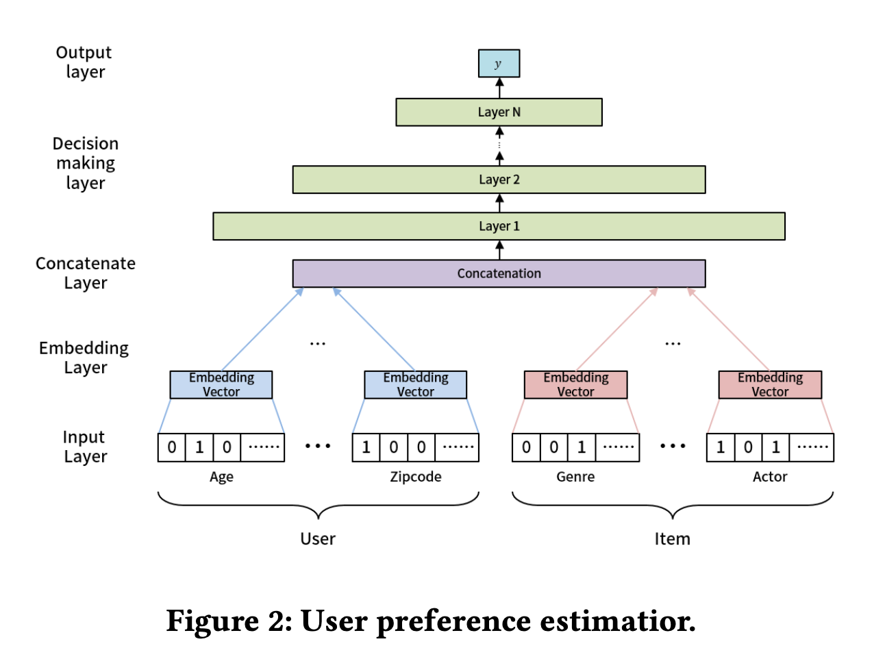

MeLU
==============================================

Introduction
-------------------------

`[paper] <https://dl.acm.org/doi/abs/10.1145/3292500.3330859>`_

**Title:** MeLU: Meta-Learned User Preference Estimator for Cold-Start Recommendation

**Authors:** Hoyeop Lee, Jinbae Im, Seongwon Jang, Hyunsouk Cho, Sehee Chung

**Abstract:**  This paper proposes a recommender system to alleviate the cold-start problem that can estimate user preferences based on only a small number of items. To identify a user's preference in the cold state, existing recommender systems, such as Netflix, initially provide items to a user; we call those items evidence candidates. Recommendations are then made based on the items selected by the user. Previous recommendation studies have two limitations: (1) the users who consumed a few items have poor recommendations and (2) inadequate evidence candidates are used to identify user preferences. We propose a meta-learning-based recommender system called MeLU to overcome these two limitations. From meta-learning, which can rapidly adopt new task with a few examples, MeLU can estimate new user's preferences with a few consumed items. In addition, we provide an evidence candidate selection strategy that determines distinguishing items for customized preference estimation. We validate MeLU with two benchmark datasets, and the proposed model reduces at least 5.92% mean absolute error than two comparative models on the datasets. We also conduct a user study experiment to verify the evidence selection strategy.

Quick Start Example
-------------------------

**Model Hyper-Parameters:**

- ``meta_args.support_num(int/'none')`` : The number of sample in support set.

- ``meta_args.query_num(int)`` : The number of sample in query set.

- ``embedding_size(int)`` : The embedding size of feature fields.

- ``mlp_hidden_size(list of int)`` : The hidden size of MLP layers.

- ``melu_args.local_lr(float)`` : The learning rate of task-specific process.

- ``melu_args.lr(float)`` : The learning rate of global update process.

We have implemented MeLU with both FOMAML and Full MAML.

**A Running Example for FOMAML:**

.. code:: python

    from recbole.utils import init_logger, init_seed
    from recbole.config import Config
    from MetaUtils import *
    from model.FOMeLU.MeLUTrainer import FOMeLUTrainer
    from model.FOMeLU.MeLU import FOMeLU

    if __name__ == '__main__':
        config = Config(model=FOMeLU, dataset='ml-100k',config_file_list=['model/FOMeLU/FOMeLU.yaml'])
        init_seed(config['seed'], config['reproducibility'])

        # logger initialization
        init_logger(config)
        logger = getLogger()
        logger.info(config)

        # dataset filtering
        dataset = create_meta_dataset(config)
        logger.info(dataset)

        # dataset splitting
        train_data, valid_data, test_data = meta_data_preparation(config, dataset)

        # model loading and initialization
        model = FOMeLU(config, train_data.dataset).to(config['device'])
        logger.info(model)

        # trainer loading and initialization
        trainer = FOMeLUTrainer(config, model)

        # model training
        best_valid_score, best_valid_result = trainer.fit(train_data, valid_data)

        # model evaluation
        test_result = trainer.evaluate(test_data)

        logger.info('best valid result: {}'.format(best_valid_result))
        logger.info('test result: {}'.format(test_result))