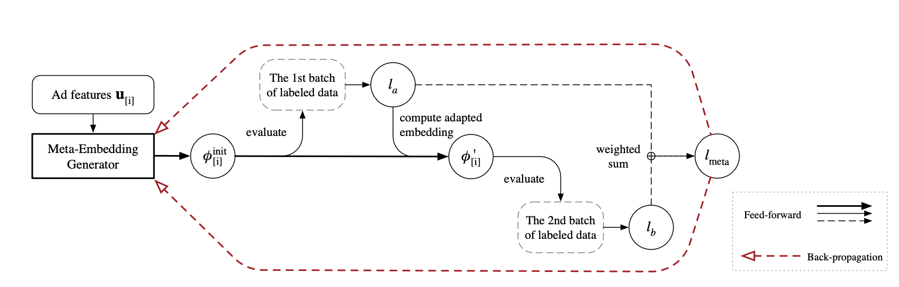

MetaEmb
==============================================

Introduction
-------------------------

`[paper] <https://doi.org/10.1145/3331184.3331268>`_

**Title:** Warm Up Cold-start Advertisements: Improving CTR Predictions via Learning to Learn ID Embeddings

**Authors:** Pan, Feiyang, et al.

**Abstract:**  Click-through rate (CTR) prediction has been one of the most central problems in computational advertising. Lately, embedding techniques that produce low-dimensional representations of ad IDs drastically improve CTR prediction accuracies. However, such learning techniques are data demanding and work poorly on new ads with little logging data, which is known as the cold-start problem.
In this paper, we aim to improve CTR predictions during both the cold-start phase and the warm-up phase when a new ad is added to the candidate pool. We propose Meta-Embedding, a meta-learning-based approach that learns to generate desirable initial embeddings for new ad IDs. The proposed method trains an embedding generator for new ad IDs by making use of previously learned ads through gradient-based meta-learning. In other words, our method learns how to learn better embeddings. When a new ad comes, the trained generator initializes the embedding of its ID by feeding its contents and attributes. Next, the generated embedding can speed up the model fitting during the warm-up phase when a few labeled examples are available, compared to the existing initialization methods.
Experimental results on three real-world datasets showed that Meta-Embedding can significantly improve both the cold-start and warm-up performances for six existing CTR prediction models, ranging from lightweight models such as Factorization Machines to complicated deep models such as PNN and DeepFM. All of the above apply to conversion rate (CVR) predictions as well.

Quick Start Example
-------------------------

**A Running Example:**

.. code:: python

    from recbole.utils import init_logger, init_seed
    from recbole.config import Config
    from MetaUtils import *

    modelName='MetaEmb'
    datasetName='ml-100k'
    trainerName=modelName+'Trainer'
    configPath=['model/'+modelName+'/'+modelName+'.yaml']
    trainerClass = importlib.import_module('model.' + modelName + '.' + modelName + 'Trainer').__getattribute__(
            modelName + 'Trainer')
    modelClass = importlib.import_module('model.' + modelName + '.' + modelName).__getattribute__(modelName)

    if __name__ == '__main__':
        config = Config(model=modelClass, dataset=datasetName, config_file_list=configPath)
        init_seed(config['seed'], config['reproducibility'])

        # logger initialization
        init_logger(config)
        logger = getLogger()
        logger.info(config)

        # dataset filtering
        dataset = create_meta_dataset(config)
        logger.info(dataset)

        # dataset splitting
        train_data, valid_data, test_data = meta_data_preparation(config, dataset)
        logger.info(train_data)

        # model loading and initialization
        model = modelClass(config, train_data.dataset).to(config['device'])
        logger.info(model)

        # trainer loading and initialization
        trainer = trainerClass(config, model)

        # model training
        best_valid_score, best_valid_result = trainer.fit(train_data, valid_data)

        # model evaluation
        test_result = trainer.evaluate(test_data)

        logger.info('best valid result: {}'.format(best_valid_result))
        logger.info('test result: {}'.format(test_result))
