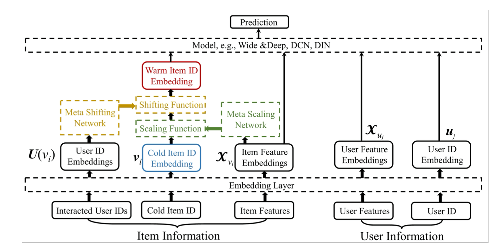

MWUF
==============================================

Introduction
-------------------------

`[paper] <https://doi.org/10.1145/3404835.3462843>`_

**Title:** Learning to Warm Up Cold Item Embeddings for Cold-start Recommendation with Meta Scaling and Shifting Networks

**Authors:** Zhu, Yongchun, et al.

**Abstract:**  Recently, embedding techniques have achieved impressive success in recommender systems. However, the embedding techniques are data demanding and suffer from the cold-start problem. Especially, for the cold-start item which only has limited interactions, it is hard to train a reasonable item ID embedding, called cold ID embedding, which is a major challenge for the embedding techniques. The cold item ID embedding has two main problems: (1) A gap is existing between the cold ID embedding and the deep model. (2) Cold ID embedding would be seriously affected by noisy interaction. However, most existing methods do not consider both two issues in the cold-start problem, simultaneously. To address these problems, we adopt two key ideas: (1) Speed up the model fitting for the cold item ID embedding (fast adaptation). (2) Alleviate the influence of noise. Along this line, we propose Meta Scaling and Shifting Networks to generate scaling and shifting functions for each item, respectively. The scaling function can directly transform cold item ID embeddings into warm feature space which can fit the model better, and the shifting function is able to produce stable embeddings from the noisy embeddings. With the two meta networks, we propose Meta Warm Up Framework (MWUF) which learns to warm up cold ID embeddings. Moreover, MWUF is a general framework that can be applied upon various existing deep recommendation models. The proposed model is evaluated on three popular benchmarks, including both recommendation and advertising datasets. The evaluation results demonstrate its superior performance and compatibility.

Quick Start Example
-------------------------

**A Running Example:**

.. code:: python

    from recbole.utils import init_logger, init_seed
    from recbole.config import Config
    from MetaUtils import *

    modelName='MWUF'
    datasetName='ml-100k'
    trainerName=modelName+'Trainer'
    configPath=['model/'+modelName+'/'+modelName+'.yaml']
    trainerClass = importlib.import_module('model.' + modelName + '.' + modelName + 'Trainer').__getattribute__(
            modelName + 'Trainer')
    modelClass = importlib.import_module('model.' + modelName + '.' + modelName).__getattribute__(modelName)

    if __name__ == '__main__':
        config = Config(model=modelClass, dataset=datasetName, config_file_list=configPath)
        init_seed(config['seed'], config['reproducibility'])

        # logger initialization
        init_logger(config)
        logger = getLogger()
        logger.info(config)

        # dataset filtering
        dataset = create_meta_dataset(config)
        logger.info(dataset)

        # dataset splitting
        train_data, valid_data, test_data = meta_data_preparation(config, dataset)
        logger.info(train_data)

        # model loading and initialization
        model = modelClass(config, train_data.dataset).to(config['device'])
        logger.info(model)

        # trainer loading and initialization
        trainer = trainerClass(config, model)

        # model training
        best_valid_score, best_valid_result = trainer.fit(train_data, valid_data)

        # model evaluation
        test_result = trainer.evaluate(test_data)

        logger.info('best valid result: {}'.format(best_valid_result))
        logger.info('test result: {}'.format(test_result))
