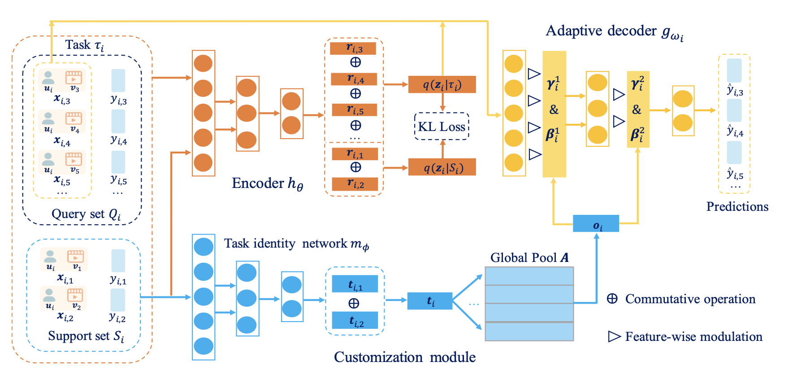

TaNP
==============================================

Introduction
-------------------------

`[paper] <https://doi.org/10.1145/3442381.3449908>`_

**Title:** Task-adaptive Neural Process for User Cold-Start Recommendation

**Authors:** Lin X, Wu J, Zhou C, et al.

**Abstract:**  User cold-start recommendation is a long-standing challenge for recommender systems due to the fact that only a few interactions of cold-start users can be exploited. Recent studies seek to address this challenge from the perspective of meta learning, and most of them follow a manner of parameter initialization, where the model parameters can be learned by a few steps of gradient updates. While these gradient-based meta-learning models achieve promising performances to some extent, a fundamental problem of them is how to adapt the global knowledge learned from previous tasks for the recommendations of cold-start users more effectively.
In this paper, we develop a novel meta-learning recommender called task-adaptive neural process (TaNP). TaNP is a new member of the neural process family, where making recommendations for each user is associated with a corresponding stochastic process. TaNP directly maps the observed interactions of each user to a predictive distribution, sidestepping some training issues in gradient-based meta-learning models. More importantly, to balance the trade-off between model capacity and adaptation reliability, we introduce a novel task-adaptive mechanism. It enables our model to learn the relevance of different tasks and customize the global knowledge to the task-related decoder parameters for estimating user preferences. We validate TaNP on multiple benchmark datasets in different experimental settings. Empirical results demonstrate that TaNP yields consistent improvements over several state-of-the-art meta-learning recommenders.

Quick Start Example
-------------------------

**A Running Example:**

.. code:: python

    from recbole.utils import init_logger, init_seed
    from recbole.config import Config
    from MetaUtils import *

    modelName='TaNP'
    datasetName='ml-100k'
    trainerName=modelName+'Trainer'
    configPath=['model/'+modelName+'/'+modelName+'.yaml']
    trainerClass = importlib.import_module('model.' + modelName + '.' + modelName + 'Trainer').__getattribute__(
            modelName + 'Trainer')
    modelClass = importlib.import_module('model.' + modelName + '.' + modelName).__getattribute__(modelName)

    if __name__ == '__main__':
        config = Config(model=modelClass, dataset=datasetName, config_file_list=configPath)
        init_seed(config['seed'], config['reproducibility'])

        # logger initialization
        init_logger(config)
        logger = getLogger()
        logger.info(config)

        # dataset filtering
        dataset = create_meta_dataset(config)
        logger.info(dataset)

        # dataset splitting
        train_data, valid_data, test_data = meta_data_preparation(config, dataset)
        logger.info(train_data)

        # model loading and initialization
        model = modelClass(config, train_data.dataset).to(config['device'])
        logger.info(model)

        # trainer loading and initialization
        trainer = trainerClass(config, model)

        # model training
        best_valid_score, best_valid_result = trainer.fit(train_data, valid_data)

        # model evaluation
        test_result = trainer.evaluate(test_data)

        logger.info('best valid result: {}'.format(best_valid_result))
        logger.info('test result: {}'.format(test_result))
